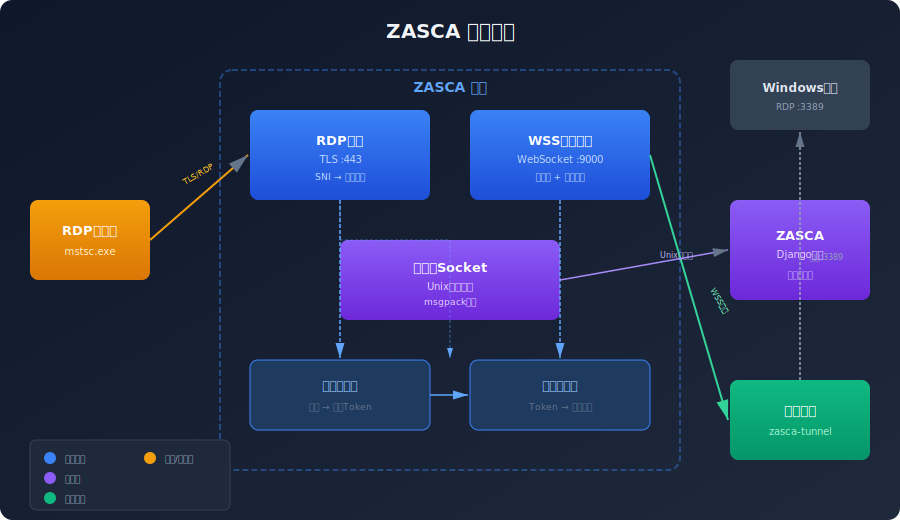
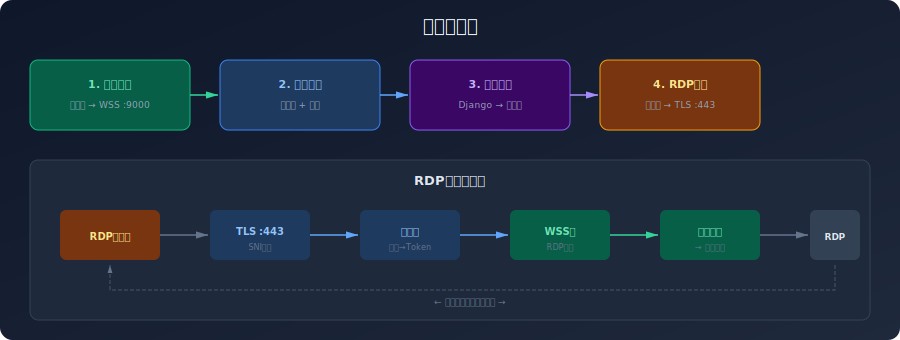

<div align="center">

<h1>ZASCA Gateway</h1>

<p>
  <strong>隧道网关 — RDP 代理 + WSS 隧道服务 + 控制面</strong><br>
  为零公网 IP 的 Windows 主机提供安全 RDP 访问通道
</p>

<p>
  
  
</p>

</div>

---

## 架构概览



Gateway 是 ZASCA 生态的可选组件，提供三个核心服务：

| 服务 | 端口 | 协议 | 说明 |
|------|------|------|------|
| **RDP Proxy** | :443 | TLS/TCP | SNI 域名路由 → 隧道转发 |
| **WSS Server** | :9000 | WebSocket | 隧道接入 + 心跳检测 |
| **Control Socket** | Unix Socket | msgpack | Django 控制面 |

## 数据流



### RDP 访问流程

1. **Tunnel 连接**：边缘端 `zasca-tunnel` 通过 WSS 连接到 Gateway，注册到 Tunnel Pool
2. **域名绑定**：ZASCA Django 通过 Control Socket 发送 `domain_bind` 命令
3. **RDP 连接**：用户通过 `rdp-xxx.zasca.com:443` 连接，Gateway 提取 SNI 路由到对应隧道
4. **数据转发**：RDP 数据通过 WSS 帧转发到边缘端，边缘端转发到本地 `localhost:3389`

### 控制协议

通过 Unix Domain Socket 通信，使用 msgpack 编码：

| 命令 | 说明 |
|------|------|
| `domain_bind` | 绑定域名到隧道 Token |
| `domain_unbind` | 解绑域名 |
| `tunnel_kick` | 踢掉指定隧道连接 |
| `tunnel_stats` | 查询隧道状态统计 |
| `remote_exec` | 通过隧道远程执行命令 |

### 事件推送

Gateway 主动向 Django 推送事件：

| 事件 | 说明 |
|------|------|
| `tunnel_online` | 隧道上线 |
| `tunnel_offline` | 隧道离线 |
| `rdp_connect` | RDP 连接建立 |
| `rdp_disconnect` | RDP 连接断开 |
| `remote_exec_result` | 远程执行结果 |

## 项目结构

```
gateway/
├── cmd/gateway/main.go        # 入口
├── internal/
│   ├── config/                # YAML 配置加载
│   ├── protocol/              # msgpack 控制协议定义
│   ├── control/               # Unix Socket 服务器
│   │   ├── socket.go          # Socket 监听 + 读写
│   │   ├── handler.go         # 命令处理 (DomainRouter 接口)
│   │   └── notifier.go        # 事件广播器
│   ├── tunnel/                # WSS 隧道层
│   │   ├── frame.go           # 二进制帧编解码
│   │   ├── server.go          # WSS 接入服务
│   │   ├── conn.go            # TunnelConn 管理
│   │   ├── pool.go            # 连接池
│   │   └── heartbeat.go       # 心跳超时
│   └── rdp/                   # RDP 代理层
│       ├── router.go          # SNI 域名路由
│       ├── proxy.go           # TLS TCP 代理
│       ├── sni.go             # SNI 提取
│       └── session.go         # 会话管理
├── pkg/logger/                # 日志封装
├── configs/gateway.yaml       # 默认配置
├── go.mod
└── go.sum
```

## 快速开始

### 构建

```bash
go build -o zasca-gateway ./cmd/gateway/
```

### 配置

编辑 `configs/gateway.yaml`：

```yaml
tunnel:
  port: 9000
  heartbeat_sec: 30
  timeout_sec: 90

rdp:
  port: 443
  tls_cert: "/etc/zasca/tls/cert.pem"
  tls_key: "/etc/zasca/tls/key.pem"
  rdp_domain: "zasca.com"

control:
  socket_path: "/run/zasca/control.sock"
```

### 运行

```bash
./zasca-gateway -config configs/gateway.yaml
```

### 交叉编译

```bash
# Linux AMD64
GOOS=linux GOARCH=amd64 go build -o zasca-gateway-linux ./cmd/gateway/

# Linux ARM64
GOOS=linux GOARCH=arm64 go build -o zasca-gateway-arm64 ./cmd/gateway/
```

## 设计要点

- **循环依赖解耦**：`control` ↔ `rdp` 通过 `DomainRouter`/`EventBroadcaster` 接口解耦
- **帧协议**：3 字节头 (2B length + 1B channel) + payload，支持 RDP/WinRM/RemoteExec/Control 四通道
- **心跳机制**：30s 间隔发送，90s 超时断开
- **自动重连**：边缘端指数退避重连（1s → 60s）

## 许可证

MIT License - 查看 [LICENSE](LICENSE) 文件了解详情。
